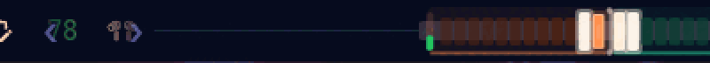
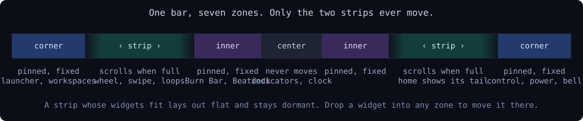
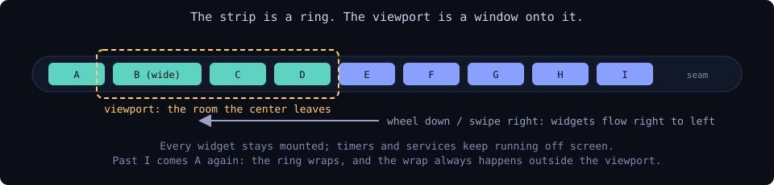
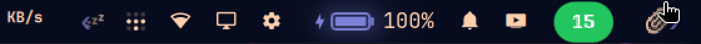
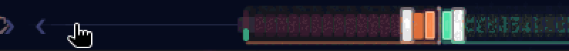
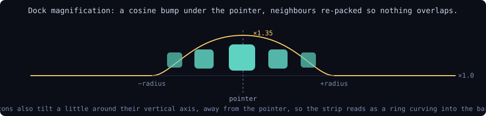
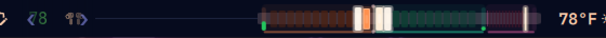
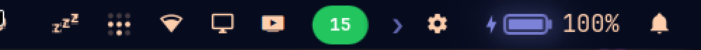
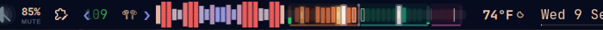
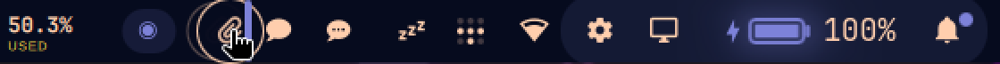

# MenuBar Overload

**The Omarchy bar with an endless carousel on each side, so it can hold more
plugins than fit on the screen.**


That is the whole bar on a 1920px laptop, 30 widgets, at rest. Nothing is
scrolling because everything fits. Add a few more plugins and the sides turn
into carousels:



## What it does



The left and right sections become strips that scroll inside the room the
center section leaves. A strip whose widgets fit is laid out exactly as
before and stays dormant. One that overflows becomes a ring: every widget
stays mounted, so timers, IPC handlers and services keep running, and the
ones that do not fit sit past the edge of a clipped viewport until you scroll
them in. The center never scrolls.

### Scroll it

Mouse wheel or a two-finger trackpad swipe anywhere over a strip. Wheel down
or swipe right moves the widgets right to left; wheel up or swipe left brings
them back. The motion eases, and the ring loops forever in both directions.






### It magnifies like a dock

The widgets under the pointer swell and tilt in 3D as they pass, and spread
apart so they never overlap.






### It tells you there is more

The edges of a scrolling strip fade under a wash of bar colour and a chevron
breathes at each end. Click a chevron to scroll a notch, right-click it to go
home.



### It stays where you put it

A scrolled strip drifts back home after six idle seconds. Click any widget
on it and it stays where you left it until you scroll again.

### Pin what should never move

Each side has two pinned zones, off the carousel. The **corner** holds the
launcher and workspaces on the far left, the bell, power and control center
on the far right. The **inner** zone sits beside the center, left of the
system indicators and the clock; Burn Bar and Beatdeck live there and
stretch into the free room exactly as they do on the stock bar.





Drag a widget into a zone to pin it there. While you drag, the zones light
up and an empty zone shows a well to drop into. Drag it back onto the strip
to unpin it.



Drops are zone-aware: a widget let go left of the center content lands in
the left section, right of it in the right section, so nothing slips into
the center by accident.

### It is kind to widgets that change size

Stretch widgets (Burn Bar, Beatdeck) shrink to make room before a strip
starts scrolling, and hold their configured width while it scrolls instead
of chasing a moving edge. A widget that grows is given its room at once; one
that shrinks eases, so the strip flows rather than jumps.

Hotkey-summoned panels (`omarchy-shell shell summon <id>`) scroll their
widget into view first.

## Install

```bash
git clone https://github.com/nixfred/menu.bar.overload ~/Projects/menu.bar.overload
~/Projects/menu.bar.overload/install.sh --use
```

`install.sh` symlinks `nixfred.menubar-overload` into
`~/.config/omarchy/plugins/` and, with `--use`, makes it the active bar. To go
back: `omarchy bar use pi.bar` (or `omarchy bar reset` for the stock one).

There is no daemon to run: the bar lives inside `omarchy-shell`, which
Hyprland starts at login, and the shell loads whichever bar `shell.json`
names. `install.sh --boot` adds a login-time safety net anyway, a oneshot
systemd user unit (`menubar-overload.service`) that re-links the plugin and
re-selects it if either was lost, so the carousel is there after every
reboot.

The bar is a clone of Omarchy's `omarchy.bar` engine as it stands in
`~/.config/omarchy/plugins/pi.bar` (the "Locked Bar": fixed to the top edge,
no transparency toggle, no drag-to-move gestures, no wheel-to-volume on the
microphone). Everything else in this repo is the carousel.

## Driving it

`bin/menubar-overload` wraps the bar's IPC target and settings:

```
menubar-overload                          state of both strips
menubar-overload scroll left|right [PX]   scroll PX pixels (negative = back)
menubar-overload home [left|right]        scroll home
menubar-overload hold left|right on|off   keep a strip where it is / let it drift
menubar-overload pin <plugin> [outer|inner|off]
                                          pin a widget to a corner or beside the center
menubar-overload pinned                   list pinned widgets by zone
menubar-overload add <plugin> [left|right]
menubar-overload set wheel on|off
menubar-overload set invert-wheel on|off
menubar-overload set step <px>            pixels per wheel notch (64)
menubar-overload set animation <ms>       easing per scroll (240, 0 = instant)
menubar-overload set return <seconds>     drift home after N idle seconds (6, 0 = never)
menubar-overload set magnify <factor>     dock magnification (0.35, 0 = off)
menubar-overload set radius <px>          reach of the magnification (84)
menubar-overload set tilt <degrees>       3D tilt at the edge of the reach (16)
menubar-overload set edge-hints on|off    fading edges and chevrons
```

The raw IPC surface, for keybindings:

```
omarchy-shell menubar-overload scroll right 64
omarchy-shell menubar-overload scroll right -64
omarchy-shell menubar-overload home all
omarchy-shell menubar-overload status
```

Settings live in the `bar.carousel` block of `~/.config/omarchy/shell.json`:

```json
"carousel": { "wheel": true, "invertWheel": false, "step": 64, "animation": 240,
              "returnAfter": 6, "magnify": 0.35, "radius": 84, "tilt": 16,
              "edgeHints": true }
```

A widget's zone is the `zone` key on its layout entry (`"outer"` or
`"inner"`), which `omarchy bar set <id> zone inner` also writes. The key
is deliberately not `pinned`: the tray widget keeps its pinned icon ids
there.

On a strip that overflows, the wheel scrolls the strip even over a widget
that normally takes the wheel (volume, brightness); hold Ctrl to reach the
widget. When everything fits, widgets keep the wheel as before.

## How it works

`Bar.qml` lays each side out as corner list, `ScrollDeck`, inner list. Each
slot reports its width; `BarModel.ringView` turns the widths, the viewport,
the scroll offset and the pointer position into an x, scale and tilt for
every entry. The offset is a plain number the deck eases toward a target the
bar shares across monitors, so a scroll is a translation and the ring wraps
by arithmetic, always outside the viewport. Magnified widgets are re-packed
outward from the one nearest the pointer at their scaled widths, which is
what keeps them from overlapping.

The strip judges whether it must scroll on a budget that assumes its stretch
widgets at their minimum, so they shrink before it scrolls; while it scrolls
they are told not to stretch.

Drag and drop addresses entries as `{id, occurrence}` references rather than
names, so layouts with repeated ids (spacers) stay unambiguous.

Bar plugin code is not hot-reloaded by the shell the way widget plugins are;
after editing `Bar.qml` run `omarchy restart shell`.

Tests for the pure layout model: `node --test tests/`. The pre-release bug
check by Codex, and what was done about it, is in `docs/reviews/`.
